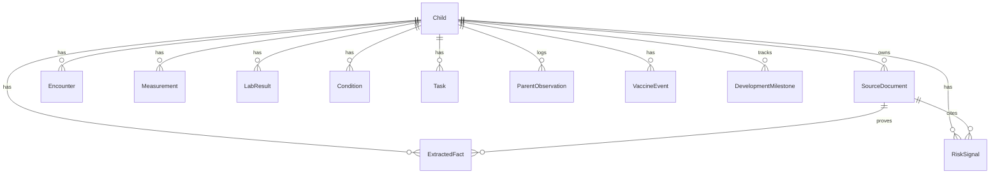

# Child Health Dashboard ER diagram

Model invariant: accepted/doctor-confirmed facts require source document, page, snippet, confidence, reviewer actor, and review timestamp. Facts-vs-interpretation is encoded by `fact_type`.
